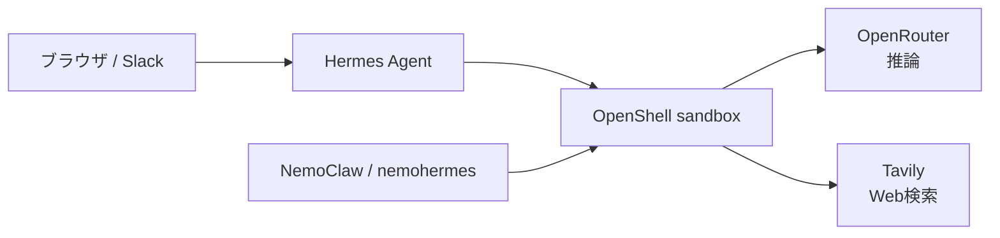

## はじめに

NemoClawで隔離されたHermes Agent環境をmacOS上に作り、次の構成までセットアップします。

- 推論: OpenRouterの無料モデルルーター
- チャット: Hermes AgentのWebダッシュボード
- メッセージング: Slack App
- Web検索: Tavily
- 応答言語と時刻: 日本語、Asia/Tokyo

この記事は、実際のセットアップで遭遇したダッシュボードの接続不良、Slackのホームチャンネル、UTCログの見え方も含めた作業記録です。

:::message
この記事のコマンドは、NemoClawのHermes用CLIである`nemohermes`を使います。NemoClawは開発中のため、実行前に公式ドキュメントと`--help`で現行仕様を確認してください。
:::

## 全体像



各コンポーネントの役割は次のとおりです。

| コンポーネント | 役割 |
| --- | --- |
| NemoClaw | Hermes環境の作成、更新、復旧、設定を管理する |
| OpenShell | サンドボックス、ネットワークポリシー、資格情報を管理する |
| Hermes Agent | エージェント本体、Webダッシュボード、Slack連携を提供する |
| OpenRouter | 複数のLLMへアクセスする推論プロバイダー |
| Tavily | エージェントへWeb検索機能を追加する |

NemoClaw専用の独立した管理画面があるわけではありません。日常的な会話と設定確認にはHermesのダッシュボード、ライフサイクル管理には`nemohermes` CLIを使います。

## 検証環境

この記事で確認した環境は次のとおりです。ホストの全リソースをコンテナへ割り当てるのではなく、Colimaを6 vCPU・16GBで起動しています。

| 項目 | バージョン・設定 |
| --- | --- |
| ホスト | Mac mini（Mac16,10） |
| CPU | Apple M4、10コア（高性能4コア・高効率6コア） |
| メモリ | 32GB |
| OS | macOS 26.6（25G72） |
| Colima割り当て | 6 vCPU・16GB |
| nemohermes | 0.0.97 |
| OpenShell | 0.0.85 |
| Hermes Agent | 0.18.0 |
| サンドボックス名 | `hermes` |
| 推論モデル | `openrouter/free` |
| タイムゾーン | `Asia/Tokyo` |

Apple Silicon版macOSはNemoClawのテスト対象ですが、一部制約があります。本番利用前に[前提条件](https://docs.nvidia.com/nemoclaw/user-guide/hermes/get-started/prerequisites)を確認してください。

## 1. macOS側の準備

Command Line ToolsとHomebrewを準備したうえで、ColimaとDocker CLIをインストールします。

```bash
xcode-select --install
brew install colima docker
```

このMacは10コアCPU・32GBメモリを搭載しているため、サンドボックスへ6 CPU・16GBメモリを割り当ててColimaを起動します。

```bash
colima start --cpu 6 --memory 16
docker info
```

NemoClawの目安となる最小構成は4 vCPU・8GBです。この実機ではHermesのビルドや複数ツールの実行に余裕を持たせつつ、macOS側へ4コア・16GBを残す配分にしました。Docker Desktopを使っている場合はColimaへの置き換えは不要です。

## 2. NemoClawとHermes Agentの導入

公式インストーラーを実行します。

```bash
curl -fsSL https://www.nvidia.com/nemoclaw.sh | bash
```

対話形式のオンボーディングでは、次のように選びました。

1. Agent runtime: **Hermes Agent**
2. Sandbox name: **hermes**
3. Inference provider: **OpenRouter**
4. Model: **openrouter/free**
5. Network policy: **Balanced**
6. TavilyとSlack: 必要に応じてオンボーディング時、または後から追加

Express setupが別のランタイムを選ぶ場合は、カスタム設定へ進んでHermes Agentを明示的に選択します。初回はコンテナイメージのビルドに数分かかることがあります。

完了後、状態を確認します。

```bash
nemohermes hermes status
nemohermes hermes doctor --json
```

## 3. OpenRouterを設定する

### APIキーを発行する

1. [OpenRouterのAPI Keys画面](https://openrouter.ai/settings/keys)へサインインする
2. **Create Key**をクリックする
3. Nameへ`nemoclaw-hermes`など用途が分かる名前を入力する
4. 必要ならCredit limitを設定し、キーを作成する
5. 作成直後に表示されるキーをコピーする

OpenRouterのAPIキーは`sk-or-v1-`から始まります。本記事では次のようにマスクして表記します。

```text
sk-or-v1-********************************
```

### NemoClawへ登録する

オンボーディングを起動します。

```bash
nemohermes onboard
```

Inference providerで**OpenRouter**を選び、`OPENROUTER_API_KEY`の入力画面へコピーしたキーを入力します。ブラウザでローカル資格情報フォームが開いた場合も、入力する内容は同じです。

```text
入力項目: OPENROUTER_API_KEY
入力例:   sk-or-v1-********************************
```

:::message alert
画面やログに表示される`OPENROUTER_API_KEY:secret`は「`OPENROUTER_API_KEY`という秘密入力欄」を表す定義です。APIキーの値でもシェルコマンドでもありません。
:::

登録後、無料モデルルーターへ切り替えます。

```bash
nemohermes inference set \
  --provider openrouter-api \
  --model openrouter/free \
  --sandbox hermes
```

`openrouter/free`は、利用可能な無料モデルの中からOpenRouterがルーティングします。推論料金を抑えられる一方、選択されるモデル、レート制限、応答速度、利用可能性が変動します。特定モデルの再現性や安定した処理量が必要なら、有料モデルを明示指定してください。

設定を確認します。

```bash
nemohermes credentials list
nemohermes inference get --json
nemohermes hermes status --json
```

`credentials list`に`openrouter-api`が表示され、推論ルートのモデルが`openrouter/free`になれば登録完了です。これらの確認コマンドにはAPIキーの実値は表示されません。

なお、ChatGPT PlusとAPI利用料は別契約です。Plusの料金にOpenAI APIやOpenRouterの利用料は含まれません。

## 4. Hermesダッシュボードを開く

サンドボックスを起動し、実際のURLをCLIから取得します。

```bash
nemohermes hermes start
nemohermes hermes dashboard-url --quiet
```

標準構成では次のURLです。

```text
http://127.0.0.1:18789/
```

これはHermes AgentのWebダッシュボードです。NemoClawは背後でサンドボックスとホスト側ポートフォワードを管理します。

## 5. 日本語応答と日本時間を設定する

まず、NemoClaw経由でHermesの基本設定を変更します。

```bash
nemohermes hermes config set \
  --key display.language \
  --value ja \
  --config-accept-new-path

nemohermes hermes config set \
  --key timezone \
  --value Asia/Tokyo \
  --config-accept-new-path \
  --restart
```

無料モデルで1回の出力を短めに抑えたい場合は、最大トークン数も設定できます。この例では1024にしました。

```bash
nemohermes hermes config set \
  --key model.max_tokens \
  --value 1024 \
  --config-accept-new-path
```

長い回答が必要なら値を増やすか、この設定を省略します。

ダッシュボードは別のHermesホームディレクトリを使うため、そちらにもタイムゾーンを設定します。

```bash
nemohermes hermes exec -- \
  env HERMES_HOME=/sandbox/.hermes/dashboard-home \
  hermes config set timezone Asia/Tokyo
```

モデルの応答言語を確実にするため、次のルールを両方の`SOUL.md`へ追加しました。

- `/sandbox/.hermes/SOUL.md`
- `/sandbox/.hermes/dashboard-home/SOUL.md`

```markdown
## Language

- ユーザーが明示的に別の言語を求めない限り、日本語で応答する。
- コード、コマンド、ログ、製品名などは、必要に応じて原文を保つ。
```

ファイルの編集にはサンドボックスへ接続します。

```bash
nemohermes hermes connect
```

`display.language`や`SOUL.md`は、主にモデルが生成する回答へ作用します。Slackコマンドなどに組み込まれた固定メッセージは英語のまま表示される場合があります。

## 6. Slack Appを接続する

### ManifestとScratchのどちらを選ぶか

Hermes向けの権限やイベントを漏れなく設定しやすいため、**From an app manifest**を選びます。Hermes内で現行バージョンに対応するManifestを生成します。

```bash
nemohermes hermes connect
hermes slack manifest --agent-view --write
```

生成された`/sandbox/.hermes/slack-manifest.json`の内容を、[Slack APIのApp管理画面](https://api.slack.com/apps)で貼り付けます。静的なManifestを記事からコピーするより、インストール済みHermesが生成したものを使う方がバージョン差分に強くなります。

「Pick a workspace to develop your app in」に`No Items`しか表示されない場合は、次を確認します。

1. Appを作りたいSlackワークスペースへ、同じブラウザでサインインする
2. Slack APIページを再読み込みする
3. 自分がそのワークスペースでAppを作成できる権限を持つか確認する
4. 組織のポリシーで制限されている場合は管理者へ許可を依頼する

### Socket Modeとトークン

HermesのSlack連携はSocket Modeを使います。Manifestを反映したら、Slack側で次を行います。

1. Socket Modeを有効化する
2. **Settings → Basic Information → App-Level Tokens**で`connections:write`スコープのApp-Level Tokenを発行する
3. **Settings → Install App**でAppをワークスペースへインストールし、Bot User OAuth Tokenを取得する
4. App HomeのMessagesタブを有効化する

2種類のトークンは接頭辞で区別できます。以下は形式を示すダミー値で、実際のトークンではありません。

```text
Bot User OAuth Token:
xoxb-<workspace-id>-<bot-id>-<secret>

App-Level Token:
xapp-<version>-<app-id>-<team-id>-<secret>
```

Slackポリシーを追加し、対話形式のチャンネル追加を起動します。

```bash
nemohermes hermes policy add slack --yes
nemohermes hermes channels add slack
```

入力欄と値の対応は次のとおりです。

```text
Slack Bot Token:
  xoxb-<workspace-id>-<bot-id>-<secret>

Slack App Token (Socket Mode):
  xapp-<version>-<app-id>-<team-id>-<secret>

Slack Member IDs (comma-separated allowlist):
  <YOUR_MEMBER_ID>

Slack Channel IDs (comma-separated allowlist):
  <YOUR_CHANNEL_ID>
```

Member IDはSlackで自分のプロフィールを開き、**その他 → メンバーIDをコピー**から取得します。Channel IDはチャンネル詳細の最下部で確認できます。複数指定するときはカンマで区切ります。Channel IDは任意ですが、Member IDは許可する利用者を限定するために設定します。

`channels add`は資格情報を安全に保存し、サンドボックスの再ビルドをキューへ入れます。完了後、Slackの対象チャンネルでBotを招待します。

```text
/invite @作成したBot名
```

DMまたはチャンネルでメンションし、日本語の応答が返ることを確認します。

```bash
nemohermes hermes channels status --channel slack --json
```

cron結果や他プラットフォームからの通知先を決める場合は、対象のSlackチャットで次のコマンドを実行します。

```text
/hermes sethome
```

:::message
`/hermes sethome`は、NemoClaw側の設定変更、ポリシー追加、再ビルドがすべて終わった最後に実行するのが安全です。ホームチャンネル情報は再ビルド後に再設定が必要になることがあります。
:::

## 7. Tavily検索を有効化する

### APIキーを発行する

1. [Tavilyのダッシュボード](https://app.tavily.com/home)へサインインする
2. API Keys欄を開く
3. 既存キーの**Copy**をクリックするか、新しいキーを作成する

TavilyのAPIキーは`tvly-`から始まります。本記事では次のようにマスクして表記します。

```text
tvly-********************************
```

### NemoClawへ登録する

後から追加する場合はオンボーディングを再実行します。

```bash
nemohermes onboard
```

Web search providerで**Tavily**を選び、`TAVILY_API_KEY`の入力画面へコピーしたキーを入力します。

```text
入力項目: TAVILY_API_KEY
入力例:   tvly-********************************
```

ローカル資格情報フォームがブラウザで開いた場合は、フォームへ`tvly-`から始まる値だけを入力して**Submit**をクリックします。NemoClawはキーを検証してOpenShellゲートウェイへ保存し、サンドボックスには実値ではなく資格情報リゾルバーを渡します。

中断したオンボーディングの続きから再開する場合だけ、`--resume`を使います。

```bash
nemohermes onboard --resume
```

Balancedポリシーを選んでいても、外部サービスがすべて自動許可されるわけではありません。Tavilyへの通信が未許可なら、プリセットを追加します。

```bash
nemohermes hermes policy add tavily --yes
nemohermes hermes policy list
nemohermes credentials list
```

サンドボックス名が`hermes`の場合、`credentials list`にTavily用プロバイダー`hermes-tavily-search`が表示されれば登録済みです。

設定後、Hermesへ「今日のNVIDIAのニュースをWeb検索して、出典付きで要約して」のように依頼して疎通を確認します。

## 8. セットアップ後の確認

次のコマンドで、サンドボックス、推論、Slack、ネットワークポリシーをまとめて確認できます。

```bash
nemohermes hermes status --json
nemohermes hermes doctor --json
nemohermes inference get --json
nemohermes hermes channels status --channel slack --json
nemohermes hermes policy list
openshell forward list
```

確認ポイントは次のとおりです。

- Hermesサンドボックスが`running`
- 推論プロバイダーが`openrouter-api`
- モデルが`openrouter/free`
- Slackチャンネルが設定済みで、Slackポリシーが適用済み
- Tavilyポリシーが適用済み
- ホストのダッシュボードポートが転送済み

## 9. トラブルシューティング

### ダッシュボードへアクセスできない

まず、ホスト側のポートフォワードとHTTP応答を確認します。

```bash
openshell forward list
curl -sS -o /dev/null -w '%{http_code}\n' \
  http://127.0.0.1:18789/
```

サンドボックス内部のHermesは動いているのに、`127.0.0.1:18789`へ接続できない場合は、ホスト側フォワードが停止している可能性があります。

```bash
nemohermes hermes recover
```

`recover`は、停止したゲートウェイやホストフォワードを修復します。正常なゲートウェイを無条件に再起動するコマンドではありません。

### 設定変更時にcompat hashエラーが出る

Slackの`/hermes sethome`はHermes管理の環境設定を変更します。その後にホスト側から設定を変更すると、保護された入力との差分として検出される場合があります。

予防策は、`config set`、ポリシー追加、チャンネル追加、再ビルドを先に完了し、`/hermes sethome`を最後に実行することです。すでに差分が原因で復旧できない場合は、内容を確認してからサポートされている再ビルドを行います。

```bash
nemohermes hermes rebuild --yes
```

再ビルド後は、次の点を再確認します。

- Hermes APIのBearer Tokenは変更される
- Slackのホームチャンネルは`/hermes sethome`で再設定する
- SlackとTavilyのポリシーが復元・適用されている
- ダッシュボードとSlackの疎通が取れる

### ログがUTCに見える

ホストOSとHermesのタイムゾーンを`Asia/Tokyo`にしても、すべてのログがJSTになるわけではありません。

| ログの種類 | 時刻の扱い |
| --- | --- |
| Hermesの会話、cron、システムプロンプト | `timezone`設定を参照 |
| OpenShellの監査ログ | UTCまたはUNIX epochのままの場合がある |
| NemoClawのビルド・保守ログ | UTCのままの場合がある |
| コンテナOSのシステム時刻 | UTCのままの場合がある |

UTCが残るのは、分散システムの監査ログを一貫させるための一般的な設計です。日本時間へ読み替えるときは、表示時刻へ9時間を加えます。ログの表示形式とHermesがcronを実行するタイムゾーンは分けて考えます。

## 10. Hermesを停止・起動・再起動する

Hermesの「再起動」には複数の方法があります。変更内容や障害範囲に応じて使い分けます。

| 操作 | 用途 | 保持されるもの |
| --- | --- | --- |
| `gateway restart` | Hermes Agentのプロセスだけを再起動する | 会話履歴、設定、サンドボックス |
| `stop` → `start` | Hermesサンドボックス全体を再起動する | 会話履歴、設定、資格情報 |
| `recover` | ゲートウェイやポート転送の状態を診断・復旧する | 既存サンドボックス |
| `rebuild` | Hermes本体やイメージを更新して再構築する | 原則として退避・復元されるが、通常の再起動用途では使わない |

### 通常の停止

実行中の処理がないことを確認してから停止します。

```bash
nemohermes hermes status --json
nemohermes hermes stop
openshell forward list
```

`stop`はサンドボックスを削除しません。会話履歴やHermesの設定は保持されるため、日常的な停止にはこのコマンドを使います。

### 通常の起動

Colimaが停止している場合は、コンテナランタイムを先に起動します。

```bash
colima start
docker info
nemohermes hermes start
nemohermes hermes dashboard-url --quiet
```

Colimaがすでに起動している場合、`colima start`は省略できます。最後のコマンドで表示されたURLをブラウザで開きます。

### Hermes Agentだけを再起動する

Hermesの設定変更を反映したい場合や、ダッシュボードの応答だけが不安定な場合は、まずゲートウェイだけを再起動します。

```bash
nemohermes hermes gateway restart
nemohermes hermes status --json
```

ただし、OpenShellのプロバイダー割り当て、資格情報参照、SlackやTavilyの接続設定を変更した直後は、既存プロセスが古い環境変数を保持していることがあります。その場合はサンドボックス全体を再起動します。

### サンドボックス全体を再起動する

```bash
nemohermes hermes stop
nemohermes hermes start
nemohermes hermes doctor --json
```

この方法は、`gateway restart`だけでは反映されない設定変更や、Slack・Tavily・OpenRouter経路の復旧に使います。`rebuild`とは異なり、Hermes本体のイメージは作り直しません。

### macOSを安全に再起動する

macOSを再起動する前に、オンボーディング、再構築、長時間タスクが動いていないことを確認します。Hermesが正常な状態でスナップショットを作り、Hermes、Colimaの順に停止します。

```bash
nemohermes hermes status --json
nemohermes hermes doctor --json
nemohermes hermes snapshot create --name before-reboot
nemohermes hermes stop
openshell forward list
colima stop
colima list
```

`colima list`で停止を確認したら、macOSを通常の手順で再起動します。スナップショット作成時は、Hermesへのメッセージ送信や設定変更を止めてください。

macOSの再起動後は、Colima、Hermesの順に起動します。

```bash
colima start
colima list
docker info
nemohermes hermes start
nemohermes hermes status --json
nemohermes hermes dashboard-url --quiet
```

`start`はサンドボックスを起動したあと、ゲートウェイとホスト側ポート転送も確認します。起動後もダッシュボードへアクセスできない場合は、`nemohermes hermes recover`を実行します。`recover`は既存サンドボックスを維持したまま、停止したゲートウェイやポート転送を診断・復旧します。

### 起動後の疎通確認

```bash
nemohermes hermes status --json
nemohermes hermes doctor --json
nemohermes inference get --json
nemohermes hermes channels status --channel slack --json
openshell forward list
curl -sS -o /dev/null -w 'dashboard: %{http_code}\n' http://127.0.0.1:18789/
curl -sS -o /dev/null -w 'api: %{http_code}\n' http://127.0.0.1:8642/
curl -sS -o /dev/null -w 'inference: %{http_code}\n' http://127.0.0.1:11437/
```

確認するポイントは次のとおりです。

- Hermesサンドボックスが`running`
- `doctor`の主要チェックが成功している
- ダッシュボードへアクセスできる
- SlackでBotが応答する
- Tavilyを使ったWeb検索が成功する

`openshell forward list`が空または古い表示でも、実際のURLが応答する場合があります。表示だけで判断せず、上記のHTTP確認とダッシュボードの実アクセスを併用します。また、OpenRouterの無料ルーターではモデル一覧確認が`404`となり、`status`が非ゼロで終了する場合があります。推論テスト、`doctor`、実際のHermes応答が成功していれば、モデル一覧の応答だけで故障とは判断しません。

### 起動できない場合の復旧順序

まず、再構築せずに既存環境の復旧を試します。

```bash
nemohermes hermes start
nemohermes hermes recover
nemohermes hermes doctor --json
```

OpenShellゲートウェイ自体が停止している場合は、ゲートウェイを起動してからHermesを復旧します。

```bash
openshell gateway start --name nemoclaw
nemohermes hermes start
nemohermes hermes recover
```

ダッシュボードだけにアクセスできない場合も、まず`recover`と実際のHTTP応答を確認します。`rebuild`はHermesの更新やイメージ破損からの復元に使う操作です。通常の停止・起動やポート転送の不具合では、安易に実行しないでください。

## セキュリティ上の注意

- APIキーやSlackトークンは、NemoClawの安全な資格情報入力フローだけへ入力する
- `.env`をホスト側から直接編集しない
- 秘密情報を記事、Git、チャット、スクリーンショット、シェル履歴へ残さない
- 必要な通信先だけをポリシープリセットで許可する
- Hermesの更新はNemoClawが固定するバージョンとの整合性を優先する
- OpenShell単体を勝手に更新せず、NemoClawの更新・再ビルド手順を使う

OpenRouterなどのプロバイダー資格情報はOpenShellゲートウェイに保存され、サンドボックス側にはリゾルバー用プレースホルダーが渡されます。登録状況は値を表示せずに確認できます。

```bash
nemohermes credentials list
```

## 参考資料

- [NemoClaw prerequisites](https://docs.nvidia.com/nemoclaw/user-guide/hermes/get-started/prerequisites)
- [NemoClaw quickstart](https://docs.nvidia.com/nemoclaw/user-guide/hermes/get-started/quickstart)
- [NemoClaw commands](https://docs.nvidia.com/nemoclaw/user-guide/hermes/reference/commands)
- [NemoClaw credential storage](https://docs.nvidia.com/nemoclaw/user-guide/hermes/security/credential-storage)
- [NemoClaw network policies](https://docs.nvidia.com/nemoclaw/user-guide/hermes/reference/network-policies)
- [NemoClaw OpenRouter provider](https://docs.nvidia.com/nemoclaw/user-guide/hermes/inference/hosted-inference/use-openrouter)
- [NemoClaw runtime changes](https://docs.nvidia.com/nemoclaw/user-guide/hermes/manage-sandboxes/configure-sandboxes/understand-runtime-changes)
- [NemoClaw recovery and rebuild](https://docs.nvidia.com/nemoclaw/user-guide/hermes/manage-sandboxes/operate-sandboxes/recover-and-rebuild-sandboxes)
- [Hermes Agent Slack integration](https://hermes-agent.nousresearch.com/docs/user-guide/messaging/slack/)
- [Hermes Agent configuration](https://hermes-agent.nousresearch.com/docs/user-guide/configuration)
- [OpenRouter free router](https://openrouter.ai/docs/guides/routing/routers/free-router)
- [OpenRouter pricing](https://openrouter.ai/pricing)
- [Tavily documentation](https://docs.tavily.com/)
- [ChatGPTとAPI課金の違い](https://help.openai.com/en/articles/9039756)

## まとめ

NemoClawを使うと、Hermes AgentをOpenShellサンドボックスへ隔離し、推論資格情報と外部通信をホスト側で管理できます。OpenRouterの無料ルーターは検証を始めやすく、SlackとTavilyを組み合わせることで、チャットからWeb検索まで行える実用的なエージェント環境になります。

安定運用のポイントは、設定変更を`nemohermes`経由に統一すること、外部サービスごとにポリシーを追加すること、`/hermes sethome`を最後に行うこと、そしてUTCの運用ログとHermesのタイムゾーンを区別することです。macOSを再起動するときは、スナップショットを作成してからHermes、Colimaの順に停止し、起動時は逆順に戻します。
