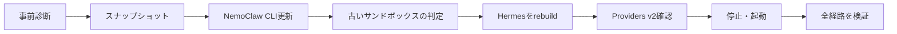

## はじめに

macOS上のNemoClaw環境で、Hermes Agentを`0.18.0`から`0.20.6`へ更新しました。

最終的には次の状態まで復旧できました。

| 項目 | 更新前 | 更新後 |
| --- | --- | --- |
| NemoHermes | 初期構築時`0.0.97` | `0.0.123` |
| OpenShell | `0.0.85` | `0.0.106` |
| Hermes Agent | `0.18.0` | `0.20.6` |
| 推論 | `openrouter-api / openrouter/free` | 同左 |
| Slack | Socket Mode | 応答・接続を復旧 |
| Web検索 | Tavily | 実検索成功 |
| Hermesの状態 | 既存データあり | 11セッション・91メッセージを保持 |

更新前のNemoHermesとOpenShellは初期構築時の記録、Hermes `0.18.0`は更新前スナップショットv9のマニフェスト、更新後は実環境の最終診断から確認した値です。

ただし、更新作業は単純な1コマンドでは終わりませんでした。旧OpenShellサンドボックスの互換性、Tavily資格情報の事前検査、バックアップのトランザクション保護、Providers v2のプロファイル・スコープ、常駐プロセスの環境変数などが連鎖して問題になりました。

この記事では、次回から使うべき安全な標準手順と、今回実際にはまったポイントを分けて説明します。初期構築については[macOSでNemoClaw + Hermes Agentを構築する記事](/articles/nemoclaw-hermes-openrouter-slack-tavily-setup)を参照してください。

:::message alert
NemoClawとOpenShellは更新が速いため、記事中のコマンドは実行前に`--help`と公式ドキュメントで確認してください。この記事の検証日は2026年9月15日です。
:::

## 検証環境

| 項目 | 構成 |
| --- | --- |
| ホスト | Mac mini（Apple M4、10コア） |
| メモリ | 32GB |
| OS | macOS 26.6 |
| コンテナランタイム | Colima、6 vCPU・16GB |
| サンドボックス名 | `hermes` |
| OpenShellゲートウェイ | `nemoclaw` |
| ダッシュボード | `127.0.0.1:18789` |
| Hermes API | `127.0.0.1:8642` |
| 推論アダプター | `127.0.0.1:11437` |

## 「Hermesの最新版」には2種類ある

今回の更新時点で、Hermes Agent本体の上流リリースには`0.21.2`がありました。一方、NemoClaw `0.0.123`が管理対象として固定していたHermesは`0.20.6`でした。

NemoClaw管理下では、Hermesだけをサンドボックス内で直接更新しません。

```text
Hermes上流の最新版
        ≠
NemoClawが検証・固定しているHermes最新版
```

`hermes update`などでエージェント本体だけを上書きすると、NemoClawのDockerイメージ、互換パッチ、OpenShell ABI、状態復元契約とずれる可能性があります。今回はNemoClawがサポートする`0.20.6`を更新先としました。

- [Hermes Agent releases](https://github.com/NousResearch/hermes-agent/releases)
- [NemoClaw v0.0.120 release notes](https://docs.nvidia.com/nemoclaw/latest/user-guide/hermes/release-notes/2026/9/4)
- [NemoClaw v0.0.123 release notes](https://docs.nvidia.com/nemoclaw/latest/user-guide/deepagents/release-notes/2026/9/10)

## 更新の全体像

ホスト側のNemoClaw更新と、Hermesサンドボックスの更新は別のトランザクションとして扱います。



重要なのは、一度に1つの更新、再構築、資格情報入力だけを進めることです。途中で失敗したら、同じコマンドを反復する前にトランザクションの終了状態を確認します。

## 安全な標準更新手順

ここからは、今回の経験を反映した推奨手順です。

### 1. 現在の状態を記録する

まず、変更を加えずに現在値を取得します。

```bash
colima list
docker context show
docker info
nemohermes --version
openshell --version
nemohermes update --check
nemohermes upgrade-sandboxes --check
nemohermes hermes status --json
nemohermes hermes doctor --json
nemohermes hermes channels status --channel slack --json
nemohermes hermes policy list
nemohermes credentials list
nemohermes hermes snapshot list
```

最低限、次を記録します。

- NemoHermes、OpenShell、Hermes Agentのバージョン
- サンドボックスが`Ready`か
- 記録済みの推論経路と実稼働中の経路が一致するか
- SlackとTavilyの登録名、ポリシー、許可リスト
- 最新の完全なスナップショットのバージョンと保存先

オンボーディング、再構築、復元、資格情報入力が進行中なら、新しい処理を始めません。ロックやリカバリージャーナルを手で削除するのも避けます。

### 2. Providers v2の整合性を確認する

OpenRouter、Slack、Tavilyを使用する環境では、再構築前にプロバイダーのスコープと添付状態を確認します。

```bash
openshell settings get --global --json --gateway nemoclaw
openshell provider list-profiles --global --output json --gateway nemoclaw
openshell provider list-profiles --output json --gateway nemoclaw
openshell provider list --all-workspaces --output json --gateway nemoclaw
openshell sandbox provider list hermes --gateway nemoclaw
```

今回の構成で、Hermesへ添付されているべきプロバイダーは次の4件です。

```text
openrouter-api
hermes-slack-bridge
hermes-slack-app
hermes-tavily-search
```

`providers_v2_enabled`が`true`であることも確認します。`false`または未設定の場合、現行ドキュメントと既存構成を確認してから有効化します。

```bash
openshell settings set \
  --global \
  --key providers_v2_enabled \
  --value true \
  --gateway nemoclaw
```

Providers v2では、プロバイダーの資格情報、許可エンドポイント、実行可能ファイル、ポリシーをプロファイル単位で扱います。プロバイダーの型と、その型のプロファイルが同じ有効スコープで見えている必要があります。

### 3. スナップショットと全体バックアップを作る

Hermesが`Ready`で、長時間タスクや書き込み処理がないことを確認してから実行します。

```bash
nemohermes hermes snapshot create --name before-upgrade
nemohermes hermes snapshot list
nemohermes backup-all
```

バックアップに失敗した場合は更新を開始しません。`failedBackupDirs`が空であること、完全なバックアップとして記録されていることを確認します。

今回の更新前には次の復元地点を作成しました。

```text
v9  pre-hermes-0-20-6-upgrade
v10 更新処理が作成した完全バックアップ
```

### 4. NemoClawのホストCLIを更新する

```bash
nemohermes update --check
nemohermes update --yes
```

更新後、実際に呼び出されるバイナリを確認します。

```bash
command -v nemohermes
nemohermes --version
openshell --version
```

通常更新では`--fresh`や`--allow-downgrade`を付けません。`--fresh`は壊れたホストインストールを再取得するとき、`--allow-downgrade`は意図的なダウングレードを許可するときの例外操作です。

### 5. 更新が必要なサンドボックスだけを判定する

```bash
nemohermes upgrade-sandboxes --check
```

`hermes`が古いと判定された場合だけ、対象を指定して再構築します。

```bash
nemohermes hermes rebuild --yes
```

`rebuild`は、状態のバックアップ、旧コンテナの置換、新イメージの作成、状態復元を管理トランザクションとして実行します。

:::message
`Rebuild preflight failed`で止まった場合、旧サンドボックスはまだ置換されていないことが多いです。出力から停止段階を確認し、表示された原因だけを直します。すぐに`rebuild --force`へ切り替えないでください。
:::

### 6. 資格情報フォームを1回限りのトランザクションとして扱う

今回の再構築では、Tavily APIキーの再検証が必要になりました。Codexなどがローカル資格情報フォームを表示した場合は、次のルールを守ります。

1. 元のCLIプロセスを終了させない
2. そのフォームに対応する待機セッションが生きていることを確認する
3. APIキーの値だけを入力する
4. 送信は1回だけ行う
5. 送信後は新しいフォームを作らず、元のCLIセッションの完了を待つ

フォームURLは一回限りです。フォーム送信中にCodexやターミナルを再起動すると、送信結果が不明になります。その場合は同じフォームを再送せず、ターミナル、サンドボックス、オンボーディング状態、資格情報の登録名を確認します。

### 7. プロバイダー変更後は必要に応じてサンドボックス全体を再起動する

Providers v2の添付やプロファイルを変更しても、すでに動いているプロセスの環境は書き換わりません。

まずHermesゲートウェイだけを再起動します。

```bash
nemohermes hermes gateway restart
```

SlackやTavilyの参照が常駐プロセスへ入らない場合は、保存済み状態を維持したままサンドボックス全体を停止・起動します。

```bash
nemohermes hermes stop
nemohermes hermes start
```

今回の最終復旧では、この停止・起動により、修正済みのプロバイダー参照が実際のHermes Gatewayへ渡りました。

### 8. 全経路を検証する

```bash
nemohermes hermes status --json
nemohermes hermes doctor --json
nemohermes inference get --json
nemohermes hermes channels status --channel slack --json
nemohermes hermes policy list
nemohermes credentials list
openshell sandbox provider list hermes --gateway nemoclaw
openshell forward list
curl -fsS -o /dev/null http://127.0.0.1:18789/
curl -fsS -o /dev/null http://127.0.0.1:8642/health
curl -fsS -o /dev/null http://127.0.0.1:11437/health
```

完了条件は次のとおりです。

- `hermes`が`Ready`
- `doctor`が`failed: 0`
- Hermes Agentの実バージョンが更新対象と一致
- 記録済み／実稼働中の推論経路が一致
- OpenRouter、Slack 2件、TavilyがHermesへ添付済み
- ダッシュボード、Hermes API、推論アダプターがHTTP成功
- Slackの`auth.test`、`apps.connections.open`、WebSocket接続が成功
- Tavilyの実検索が成功

`/hermes sethome`は、設定変更と再構築がすべて終わってから実行します。

## 今回の更新で実際に起きたこと

標準手順だけでは収束しなかった理由を、時系列で整理します。

| 段階 | 起きたこと | 判断・対応 |
| --- | --- | --- |
| 更新前 | Hermes `0.18.0`は動作していた | v9スナップショットを作成 |
| ホスト更新 | NemoHermes `0.0.123`、OpenShell `0.0.106`へ更新 | ホスト更新自体は成功 |
| 再構築preflight | Tavily資格情報を再利用できず停止 | 旧Hermesは未変更と確認 |
| 旧環境の再接続 | 旧OpenShellサンドボックスが`Provisioning`から進まない | 新旧OpenShell間の不整合と判断 |
| バックアップ | v10の完全バックアップを確保 | 復元地点として保全 |
| 再作成 | ゲートウェイログ約5.23GBが2GiB読取上限を超えた | ログを削除せず退避 |
| Docker接続 | `/var/run/docker.sock`を参照して失敗 | ColimaのDockerソケットを明示 |
| 状態復元 | v10が旧トランザクション所有と判定された | バックアップの横取り防止として停止 |
| 状態移行 | 新しい`0.20.6`へ必要な利用者データだけ移行 | `state.db`と`SOUL.md`に限定 |
| DB移行 | SQLiteスキーマ17から26へ更新 | Hermesの起動時マイグレーションで成功 |
| Slack障害 | 登録済みなのにBotが応答しない | Gatewayへ資格情報参照が未投影と判明 |
| Providers v2 | 分類不能キーにより全資格情報がfail-closed | プロファイルのスコープを修正 |
| 最終反映 | `gateway restart`だけでは不十分 | `stop`→`start`で起動環境を再取得 |

旧バックアップからは11セッション・91メッセージを復元できました。旧`.env`や`config.yaml`は新環境へコピーせず、資格情報、推論経路、Slack、Tavilyは現行NemoClawの管理経路から再構成しています。

復元後は次のスナップショットを作成しました。

```text
v12 post-hermes-0-20-6-v10-state-recovery
v13 before-slack-credential-rebind
v16 before-providers-v2-rebuild
v17 最終再構築バックアップ
```

## はまったポイントと学び

### 1. Tavily資格情報エラーは、APIキーの値だけが原因とは限らない

再構築時に次のようなエラーが出ました。

```text
Rebuild preflight failed: Tavily Search credential is invalid.
```

確認対象はAPIキーだけではありません。

- Tavilyプロバイダーが存在するか
- `tavily-hermes-v1`プロファイルが正しいスコープで見えるか
- `hermes-tavily-search`がHermesへ添付されているか
- 現在の再構築プロセスが資格情報を受け取っているか
- 既存の常駐プロセスが古い環境を保持していないか

保存済みプロバイダーがあっても、再構築の事前検査が同じプロセス内の一時資格情報を必要とする場合があります。資格情報更新と再構築を別プロセスに分けると、次の処理へ値が引き継がれないことがありました。

### 2. 資格情報フォームを何度も作ると、トランザクションが混ざる

今回最も時間を使った原因です。

```text
古いCLI待機セッション ─ 古い一回限りフォーム
新しいCLI待機セッション ─ 新しい一回限りフォーム
```

フォームが閉じた、見当たらない、Codexを再起動した、という理由で新しいフォームを作り続けると、どのフォームがどのCLI処理に対応しているか分からなくなります。その結果、対象ハッシュやトランザクションIDが一致せず、安全機構に拒否されました。

次のメッセージが出た場合は再送しません。

```text
The credential submission outcome is unknown.
Do not retry or resubmit this form.
```

まず元のターミナルとプロセス状態を確認し、古い処理が成功、失敗、終了のどれかに確定してから、新しい資格情報セッションを始めます。

### 3. `custom provider profile ... already exists`は破損ではない

```text
custom provider profile 'tavily-hermes-v1' already exists
```

`provider profile import`は作成専用です。同じIDが存在すれば失敗するのが正常です。

```bash
openshell provider list-profiles --global --output json --gateway nemoclaw
openshell provider list-profiles --output json --gateway nemoclaw
```

グローバルとワークスペースの両方を確認します。既存プロファイルを変更する必要がある場合は、現在の`resource_version`を含むエクスポートを基に`profile update`を使います。削除して再importする方法は、添付中プロバイダーへの影響が大きいため避けます。

### 4. プロファイルのIDが同じでも、スコープが違えば見えない

今回のProviders v2障害では、`openai`プロファイルがワークスペーススコープには存在しましたが、プラットフォーム側の`openrouter-api`から参照できませんでした。

その結果、OpenShellは資格情報キーを分類できず、SlackとTavilyを含む静的資格情報をfail-closedで無効化しました。

不足が確認できた場合だけ、NemoClawに同梱された定義を検査します。

```bash
openshell provider profile lint \
  --global \
  --file ~/.nemoclaw/source/nemoclaw-blueprint/provider-profiles/openai.yaml \
  --gateway nemoclaw
```

グローバルスコープに存在しないこととlint成功を確認した場合だけ登録します。

```bash
openshell provider profile import \
  --global \
  --file ~/.nemoclaw/source/nemoclaw-blueprint/provider-profiles/openai.yaml \
  --gateway nemoclaw
```

`already exists`が出たら再試行せず、スコープと既存定義を確認します。

### 5. プロバイダーを直しても、稼働中プロセスの環境は変わらない

OpenShellはプロバイダー更新後に、新しく起動するプロセスへ資格情報のプレースホルダーを渡します。すでに動いているPIDの環境は後から変更できません。

今回も、新しい`exec`では参照が見えるのに、実際の`hermes gateway run`では見えない段階がありました。最終的にはサンドボックス全体の停止・起動が必要でした。

```bash
nemohermes hermes stop
nemohermes hermes start
```

`.env`にキーがないことだけで資格情報欠落と判断しない点も重要です。Providers v2では、実値ではなくバージョン付きプレースホルダーとプロキシ書き換えを使います。

### 6. 最小化した資格情報ランチャーでは`PATH`とDocker接続に注意する

今回使った一回限りの資格情報ランチャーは、安全のため子プロセス環境を最小化していました。そのため、次の2つが起きました。

- `lsof`やDocker CLIが見つからず、ポート所有者・Docker到達確認に失敗
- `DOCKER_HOST`が渡らず、Colimaではなく`/var/run/docker.sock`を参照

これは通常のターミナルから実行する場合には起きにくく、秘密入力ヘルパーで環境変数を絞る場合の注意点です。必要な実行ファイルの固定PATHと、検証済みのColimaソケットだけを明示的に渡しました。

### 7. 巨大ログも再構築を止める

OpenShellのゲートウェイログが約5.23GBまで増え、保守処理の2GiB安全読取上限を超えました。

サンドボックスの利用者データ破損ではありません。原因ファイルを特定し、証拠保全のため削除せず退避してから再開しました。容量エラーを見て、いきなりスナップショットや会話履歴を削除しないことが重要です。

### 8. 旧バックアップのトランザクション保護を回避しない

旧v10バックアップを新しい再構築トランザクションへ復元しようとすると、所有トランザクションIDが異なるとして拒否されました。これはバックアップの横取りや誤復元を防ぐ保護機構です。

ロック、マーカー、マニフェストのIDを手で書き換えてはいけません。今回は新しい0.20.6環境を作成し、次の利用者データだけを選択して移行しました。

- Hermesの`state.db`
- 日本語応答ルールを含む`SOUL.md`

`.env`、`config.yaml`、プロバイダー情報は旧環境から持ち込まず、現行CLIで再設定しました。手動移行は通常手順ではなく、完全バックアップがあり、通常復元が安全側で拒否された場合の例外対応です。

### 9. `status`の終了コード1が、必ずしも推論障害ではない

`openrouter/free`では、モデル一覧確認先`/v1/models`がHTTP 404を返し、`nemohermes hermes status`が終了コード1になることがあります。

今回の判定では次を併用しました。

- サブプローブが`full chain reachable`
- `doctor`の推論経路が正常
- 記録済み経路と実稼働経路が一致
- 実際のHermes応答が成功

404の1項目だけを見て、再構築失敗と判断しないようにします。HTTP 429も無料ルーターの一時的なレート制限である可能性があるため、無制限に再試行しません。

### 10. `openshell forward list`が空でも実通信を確認する

最終状態では、`openshell forward list`が空表示でも、実際にはOpenShellプロセスが`18789`と`8642`を待ち受け、HTTP 200を返していました。

一覧表示だけではなく、次を併用します。

```bash
lsof -nP -iTCP:18789 -sTCP:LISTEN
lsof -nP -iTCP:8642 -sTCP:LISTEN
curl -fsS -o /dev/null http://127.0.0.1:18789/
curl -fsS -o /dev/null http://127.0.0.1:8642/health
```

実到達性も失敗している場合に限り、`nemohermes hermes recover`で復旧します。

## エラー別の判断表

| 症状 | 最初に確認すること | 避けること |
| --- | --- | --- |
| `Rebuild preflight failed` | 置換前か、表示された原因は何か | 即座に`--force` |
| Tavily credential invalid | プロバイダー、プロファイル、添付、同一プロセスの入力 | APIキー再入力の反復 |
| provider profile already exists | グローバル／ワークスペースの一覧 | 削除して再import |
| unclassified credential key | プロバイダー型とプロファイルのスコープ | Slack/Tavilyだけを疑う |
| credential submission unknown | 元のCLIセッションとプロセス状態 | 同じフォームを再送 |
| Slackが無応答 | Gatewayの資格情報参照、Socket Modeログ | Appを最初から作り直す |
| `status`が404で失敗 | `doctor`、実経路、実応答 | 404だけで再構築 |
| forward一覧が空 | `lsof`とHTTP疎通 | 転送の重複作成 |
| 復元トランザクション不一致 | バックアップ完全性と所有情報 | マニフェストの手編集 |

同じ事前検査エラーが2回続いたら、自動再試行を止めます。秘密を除外した診断が必要なら、次を使います。

```bash
nemohermes debug --quick --sandbox hermes
```

## やらない方がよい操作

- サンドボックス内でHermes本体だけを直接更新する
- バックアップを確認せず`destroy`や`rebuild --force`を実行する
- 管理対象の`.env`、`config.yaml`、レジストリを直接編集する
- リカバリージャーナルやロックを手で削除する
- 添付中のプロバイダーやプロファイルを、診断せず削除する
- 結果が不明な資格情報フォームを再送する
- 失敗中にCodex、ターミナル、Colimaを再起動する
- `status`や転送一覧の単一結果だけで故障と判断する

## 更新完了後の確認結果

2026年9月15日時点の最終確認結果です。

```text
NemoHermes:       0.0.123
OpenShell:        0.0.106
Hermes Agent:     0.20.6
Sandbox phase:    Ready
Doctor:           failed 0 / warnings 0
Inference:        openrouter-api / openrouter/free
Providers v2:     enabled
Slack providers:  attached
Tavily provider:  attached
Dashboard:        HTTP 200
Hermes API:       HTTP 200
Inference adapter: HTTP 200
```

`nemohermes upgrade-sandboxes --check`も`All sandboxes are up to date.`となりました。SlackはSocket Mode接続、Tavilyは実検索まで確認しています。

## まとめ

今回の更新で最も重要だったのは、「ホストCLI更新」と「Hermesサンドボックス更新」を分け、各トランザクションの完了を確認してから次へ進むことでした。

通常は次の流れで十分です。

```text
事前診断
→ スナップショットとbackup-all
→ nemohermes update
→ upgrade-sandboxes --check
→ 必要なHermesだけrebuild
→ Providers v2と資格情報参照を確認
→ 必要ならstop/start
→ doctor・HTTP・Slack・Tavilyを検証
```

今回のような複合障害でも、preflightで止まった段階を確認し、完全バックアップを保全し、同じ失敗を反復しなければ、会話履歴と外部連携を残したまま復旧できます。

## 参考資料

- [NemoClaw: Update Sandboxes](https://docs.nvidia.com/nemoclaw/user-guide/hermes/manage-sandboxes/operate-sandboxes/update-sandboxes)
- [NemoClaw: Recover and Rebuild Sandboxes](https://docs.nvidia.com/nemoclaw/user-guide/hermes/manage-sandboxes/operate-sandboxes/recover-and-rebuild-sandboxes)
- [NemoClaw: Understand Sandbox State](https://docs.nvidia.com/nemoclaw/user-guide/hermes/manage-sandboxes/state-and-backups/understand-sandbox-state)
- [NemoClaw: Understand Runtime Changes](https://docs.nvidia.com/nemoclaw/user-guide/hermes/manage-sandboxes/configure-sandboxes/understand-runtime-changes)
- [NemoHermes CLI Commands Reference](https://docs.nvidia.com/nemoclaw/user-guide/hermes/reference/commands)
- [OpenShell: Providers v2](https://docs.nvidia.com/openshell/sandboxes/providers-v2)
- [OpenShell: Manage Providers](https://docs.nvidia.com/openshell/sandboxes/manage-providers)
- [Hermes Agent releases](https://github.com/NousResearch/hermes-agent/releases)
